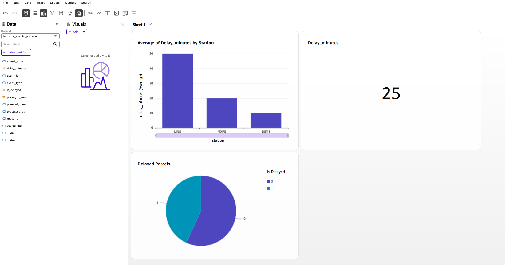
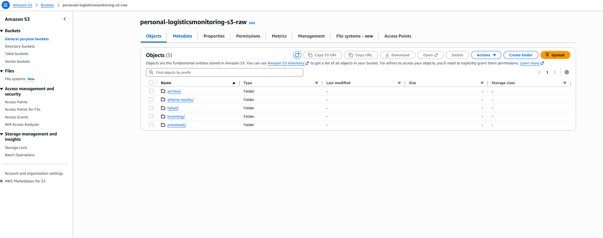
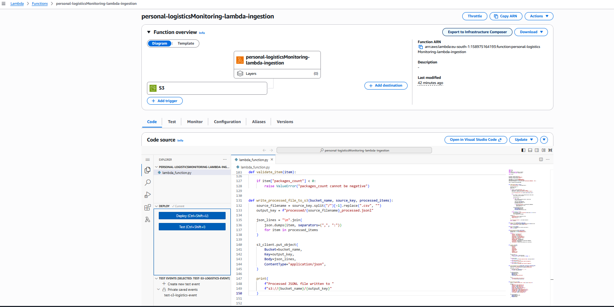
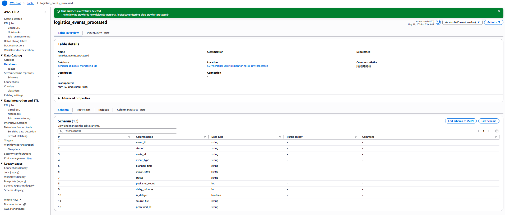

# AWS Serverless Analytics QuickSight Dashboard

## Project in One Sentence

I built a serverless AWS analytics workflow that ingests operational logistics data into S3, processes it with Lambda, catalogs it with Glue, queries it with Athena, and visualizes KPIs in QuickSight.

## What I Built

This project is a small cloud-based analytics system designed to transform raw operational data into an interactive business intelligence dashboard.

It includes:

- S3 data lake structure
- Lambda ingestion and processing
- Glue Data Catalog table
- Athena query layer
- QuickSight dashboard for KPI visualization

## Why I Built It

I built this project to practice AWS data engineering and analytics services in a realistic operations/logistics scenario.

The goal was to move beyond theoretical study and get hands-on experience with a complete analytics workflow, from raw data ingestion to business visualization.

## Architecture at a Glance

```text
Structured Data Files
        |
        v
Amazon S3
Raw Data Layer
        |
        v
AWS Lambda
Ingestion / Processing
        |
        v
Amazon S3
Processed Data Layer
        |
        v
AWS Glue Crawler
Schema Discovery
        |
        v
AWS Glue Data Catalog
Metadata Layer
        |
        v
Amazon Athena
Serverless SQL Queries
        |
        v
Amazon QuickSight
Interactive Dashboard
```

## Project Evidence

### QuickSight Dashboard



The dashboard visualizes logistics delay metrics, including average delay by station, total delay minutes, and delayed parcel distribution.

### S3 Data Lake Structure



The S3 bucket is organized into operational zones such as incoming, processed, failed, archive, and Athena query results.

### Lambda Ingestion Function



The Lambda function is connected to an S3 trigger and processes incoming logistics event files into analytics-ready data.

### Glue Data Catalog Table



AWS Glue Data Catalog stores the processed table metadata used by Athena and QuickSight.

## AWS Services Used

| Service | Purpose |
|---|---|
| Amazon S3 | Stores raw, processed, failed, archive, and Athena result data |
| AWS Lambda | Processes incoming operational data files |
| AWS Glue Crawler | Automatically discovers schema from processed S3 data |
| AWS Glue Data Catalog | Stores metadata tables used by Athena |
| Amazon Athena | Runs serverless SQL queries on S3 data |
| Amazon QuickSight | Builds interactive BI dashboards |
| AWS IAM | Manages access permissions |
| Amazon CloudWatch | Supports monitoring and troubleshooting |

## What I Learned

- How to structure a basic S3 data lake with raw and processed areas
- How to process incoming files with Lambda
- How Glue Crawler discovers schema from S3 data
- How Athena queries cataloged data without managing servers
- How QuickSight can turn analytics datasets into business dashboards
- How to think about cost optimization, cleanup, and architecture tradeoffs

## Future Improvements

- Add partitioned S3 dataset layout
- Convert CSV/JSON files to Parquet
- Add Glue ETL job for larger-scale transformation
- Add Athena views for business KPIs
- Add QuickSight calculated fields
- Add Infrastructure as Code with Terraform or CloudFormation
- Add CI/CD documentation for data pipeline deployment

## Technical Documentation

- [Architecture Diagram](architecture/README.md)
- [Project Overview](docs/project-overview.md)
- [Athena Sample Queries](sql/athena_sample_queries.sql)
- [Screenshots](screenshots/README.md)

## Certification Alignment

This project supports practical learning for AWS Data Engineering and Solution Architecture topics such as S3 data lake design, Lambda-based ingestion, Glue metadata cataloging, Athena SQL analytics, QuickSight dashboarding, IAM access control, monitoring, and cost optimization.

## Author

Created by Alberto Savino as part of a practical AWS learning path focused on Data Engineering, Analytics, Business Intelligence, and Solution Architecture.
