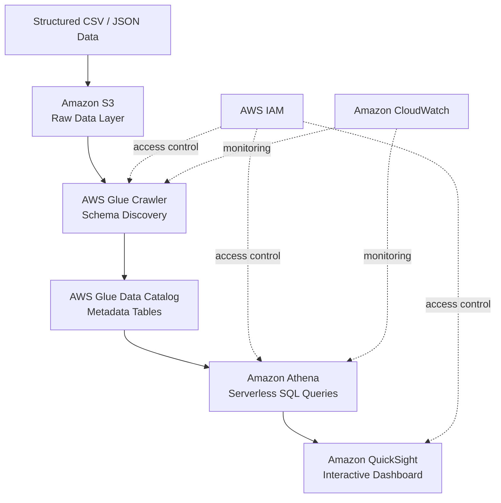

# Architecture Diagram

```mermaid
flowchart TD
    A[Structured CSV / JSON Data] --> B[Amazon S3\nRaw Data Layer]
    B --> C[AWS Glue Crawler\nSchema Discovery]
    C --> D[AWS Glue Data Catalog\nMetadata Tables]
    D --> E[Amazon Athena\nServerless SQL Queries]
    E --> F[Amazon QuickSight\nInteractive Dashboard]

    G[AWS IAM] -. access control .-> C
    G -. access control .-> E
    G -. access control .-> F

    H[Amazon CloudWatch] -. monitoring .-> C
    H -. monitoring .-> E
```
